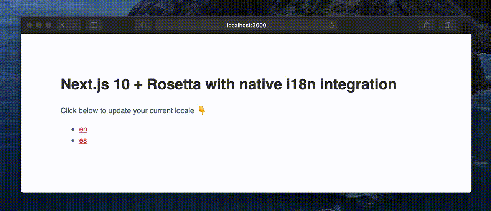

# next-rosetta 🌎🌍🌏

> Add i18n in less than 5 minutes — **Built for Next.js 10**



Lightweight, simple, easy to integrate, no custom server required and efficient because will only download the locale you need.

## Usage

### Install

First step is downloading this dependency.

```sh
# with npm
npm install next-rosetta

# with yarn
yarn add next-rosetta
```

### Update next.config.js

Update your `next.config.js` by adding a `i18n` section:

```js
// ./next.config.js
module.exports = {
  i18n: {
    locales: ["en", "es"],
    defaultLocale: "en",
  },
};
```

For more info refer to: https://nextjs.org/docs/advanced-features/i18n-routing

### Create locales

Make a directory named `i18n` on the root of your project. If you are using TypeScript you can define the type schema and create every locale by implementing that interface.

```js
// ./i18n/index.tsx
export interface MyLocale {
  locale: string;
  title: string;
  subtitle: string;
  profile: {
    button: string;
  };
}
```

```js
// ./i18n/en.tsx
import { MyLocale } from ".";

export const table: MyLocale = {
  locale: "English",
  title: "Next.js 10 + Rosetta with native i18n integration",
  subtitle: "Click below to update your current locale 👇",
  profile: {
    button: "Press me!",
  },
};
```

```js
// ./i18n/es.tsx
import { MyLocale } from ".";

export const table: MyLocale = {
  locale: "Español",
  title: "Next.js 10 + Rosetta con integración nativa de i18n",
  subtitle: "Presiona aquí abajo para cambiar tu lenguaje 👇",
  profile: {
    button: "Presióname!",
  },
};
```

### Add the i18n provider

Import `I18nProvider` from `"next-rosetta"` and wrap the base component. From `pageProps` take `table` with is the locale map and use it as prop on `I18nProvider`.

```tsx
import { AppProps } from "next/app";
import { I18nProvider } from "next-rosetta";

function MyApp({ Component, pageProps }: AppProps) {
  return (
    <I18nProvider table={pageProps.table}>
      <Component {...pageProps} />
    </I18nProvider>
  );
}

export default MyApp;
```

## Start using it

To import locales you must call this on the server side code (or on the static render):

```ts
const locale = "en";
const { table = {} } = await import(`../i18n/${locale}`);
```

If you are using `getStaticProps`:

```tsx
import { GetStaticProps } from "next";

// Import typing
import { MyLocale } from "../i18n";

export const getStaticProps: GetStaticProps<I18nProps<MyLocale>> = async (context) => {
  const locale = context.locale || context.defaultLocale;
  const { table = {} } = await import(`../i18n/${locale}`); // Import locale
  return { props: { table } }; // Passed to `/pages/_app.tsx`
};
```

Inside the components now you can use the i18n hook this library provides:

```tsx
import { useI18n } from "next-rosetta";

// Import typing
import { MyLocale } from "../i18n";

function HelloMessage() {
  const { t } = useI18n<MyLocale>();
  return (
    <div>
      <h3>
        {t("title")}
      </h3>
      <button>
        {t("profile.button")}
      </button>
    </div>
  )
}
```

For more info regarding `rosetta` API please refer to: https://github.com/lukeed/rosetta

## Example

Here is a more complete example inside the `/page` directory:

```tsx
// ./pages/index.tsx
import { useI18n, I18nProps } from "next-rosetta";
import { useRouter } from "next/router";
import Head from "next/head";
import Link from "next/link";

import { MyLocale } from "../i18n"; // Import typing

export default function Home() {
  const { locale, locales, route } = useRouter();
  const i18n = useI18n<MyLocale>();
  const { t } = i18n;

  return (
    <div>
      <Head>
        <title>{t("locale")}</title>
      </Head>
      <main>
        <h1>{t("title")}</h1>
        <p>{t("subtitle")}</p>
        <ul>
          {locales?.map((loc) => (
            <li key={loc}>
              <Link href={route} locale={loc}>
                <a className={loc === locale ? "is-active" : ""}>{loc}</a>
              </Link>
            </li>
          ))}
        </ul>
      </main>
    </div>
  );
}

// Server-side code

import { GetStaticProps } from "next";

export const getStaticProps: GetStaticProps<I18nProps<MyLocale>> = async (context) => {
  const locale = context.locale || context.defaultLocale;
  const { table = {} } = await import(`../i18n/${locale}`); // Import locale
  return { props: { table } }; // Passed to `/pages/_app.tsx`
};
```
